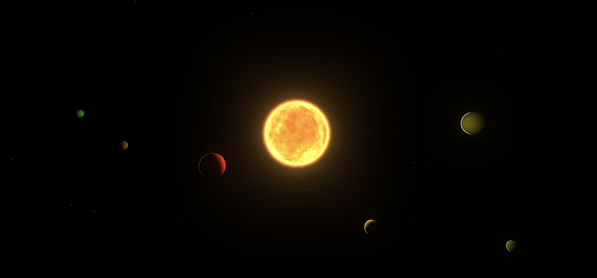

# Solaris
Explore a procedurally generated audio-visual solar system. Listen as the soundscape of orbital harmonics transforms as you move through space and time.

## Instructions
Click to start. Use the mouse to expore.

## Built with...
![TypeScript][ts-badge]
![Three][three-badge]
![Vercel][vercel-badge]
<!-- ![Vite][vite-badge] -->

[ts-badge]: https://img.shields.io/badge/typescript-%23007ACC.svg?style=for-the-badge&logo=typescript&logoColor=white
[vercel-badge]: https://img.shields.io/badge/vercel-%23000000.svg?style=for-the-badge&logo=vercel&logoColor=white
[three-badge]: https://img.shields.io/badge/threejs-black?style=for-the-badge&logo=three.js&logoColor=white
<!-- [vite-badge]: https://img.shields.io/badge/Next-black?style=for-the-badge&logo=next.js&logoColor=white -->